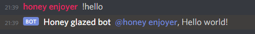

<div align="center">
<h1>Honeyglaze</h1>

Perfect framework for your honey glazed Discord bots.

  
<small>_Photo by [Arwin Neil Baichoo](https://unsplash.com/photos/yQzrDgU-KAI?utm_source=unsplash&utm_medium=referral&utm_content=creditShareLink)_</small>
</div>

Honeyglaze maintains all necessary command resolving code, allowing you to focus only on business logic of your Discord bot.

## Getting started

1. Create new npm project with `npm init`
2. Install Honeyglaze and its peer dependencies - Typescript and Discord.js  
    ```sh
    npm install honeyglaze typescript discord.js
    ```
3. Initialize Typescript  
    ```
    tsc -init
    ```  
    and in `tsconfig.json` set `experimentalDecorators` and `emitDecoratorMetadata` options to `true` as this framework relies on decorators.

4. Create the `index.ts` file and add following code:
    ```ts
    import { Client } from "discord.js";
    import { initialize } from "honeyglaze";

    const bot = new Client();
    initialize(bot);
    bot.on("ready", () => console.log("ready"));
    bot.login("add_your_own_token_here");
    ```
5. Run your bot to check if it works. I recommend using `ts-node` package to execute typescript code without compiling it yourself.  
    ```sh
    npx ts-node index.ts
    ```

## Adding commands

1. In `index.ts` declare a class that will present the group
    ```ts
    class Fun {

    }
    ```
2. Declare a method inside of it and add `@Command()` decorator of it
    ```ts
    import { Command, /* ... */ } from 'honeyglaze'
    import { Message, /* ... */ } from 'discord.js'

    //...
  
    class Fun {

      @Command()
      hello(message: Message): void {
        message.reply('Hello world!')
      }

    }
    ```
3. Turn on your bot and try to type `!hello` command in the chat  
    

## Architecture

As mentioned above, this framework fully relies on [decorators](https://www.typescriptlang.org/docs/handbook/decorators.html). They contains all of command resolving logic.

When initializing, the decorators are evaluated first. The `@Command` ones put the command's _configuration_ and its _function expression_ inside of Honeyglaze's **command registry**, which you can access with `getCommandList` and other available methods.

`initialize` method hooks to the `message` event of the `Discord.Client` instance. Whenever new message is received from the server, Honeyglaze checks if the message isn't sent by another bot and its content starts with `!` prefix. If it is - it's considered as your bot's command. Then it takes the command name (the part after the `!` symbol) and looks for command with such name in the mentioned above command registry.

If the command is not found - nothing happens. If it is found - Honeyglaze will check if the author is allowed to use it. If they're not allowed to use it - the message will be replied with an error.

Then the arguments will be validated if they're required by the command. Honeyglaze will also respond with an error message if the arguments are invalid.

After that, the command's function expression will be invoked with the message instance and command's arguments as the function's arguments.

If the function throws an error, Honeyglaze will respond in the chat with an error embed.

You're still free to add additional event listeners of your choice to Discord client instance, including `message`.

## Motivation

All the Discord bot projects start with writing the code that resolves the command. Command functions also can contain the argument resolving code, validation code and permission checks that can be up to 50-70% of all function's logic.

Trying to design proper command resolving logic with Typescript can give even more pain and take more time that you could spend on bot's functionality.

I made Honeyblaze so the bot can only contain actual business logic and make it easy to maintain, and you can save time on development.

## Usage

### Functions

#### `initialize(client: Discord.Client)`

Adds `message` event listener to the `client` instance that resolves the commands from incoming messages.

#### `getCommand(name: string)`

Gets command configuration by its name or alias.

#### `getCommandList()`

Gets whole commands list.

### Decorators

#### @Command
This is the main decorator of the whole framework. It adds the command to the command registry so it's recognized and invoked by your bot.

Usage:
```ts
@Command()
public hello(message: Message): void {
  message.reply('hello, world!')
}
```

You can also configure your command by rewriting its name, adding aliases, arguments, etc.

```ts
@Command({
  name: 'hello',
  summary: 'Just says hello to you',
  aliases: ['hi', 'whatsup', 'привет', 'gutentag'],
  args: [["Addressee", String, true]],
})
public hello(message: Message, addressee: string): void {
  message.reply(`hello, ${addressee}!`)
}
```

*It can be used only in class methods because of restrictions of Typescript decorators.*

#### @Allow

Allows the command evaluation to users with certain roles.

```ts
@Command()
@Allow(["745464790348202055", "745464790376580205"])
public hello(message: Message): void {
  message.reply('hello, world!')
}
```

#### @Restrict

Does the oppsite to what `@Allow` does - restricts the command evaluation to users with certain roles.

```ts
@Command()
@Restrict(["745464790348202055", "745464790376580205"])
public hello(message: Message): void {
  message.reply('hello, world!')
}
```

#### @Join

Adds a hook that runs when someone joins the server.

Usage:

```ts
class Fun {
  @Join()
  async greetNewcomer(guildMember: GuildMember): Promise<void> {
    const dm = await guildMember.user.createDM()
    dm.send('Oh hey! Welcome to the server!')
  }
}
```

*NOTICE:* In order to get your join-hook working, you have to enable "Server Members Intent" for your bot at https://discord.com/developers